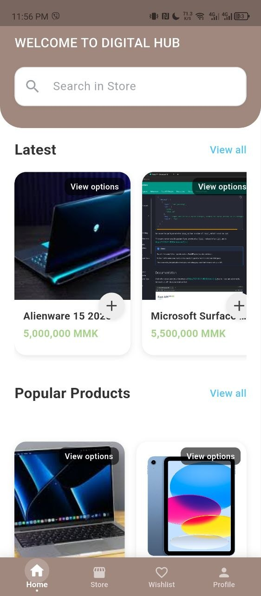
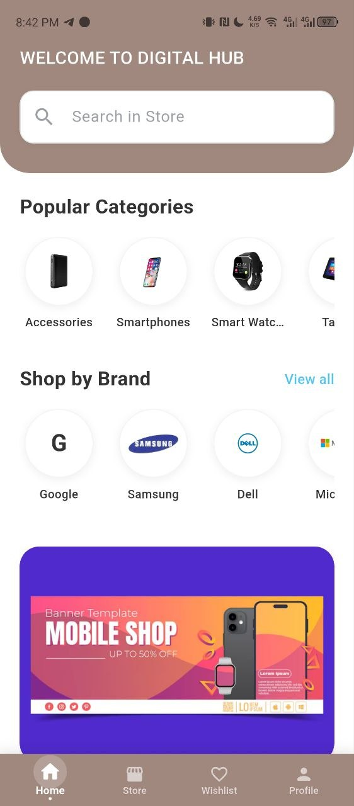
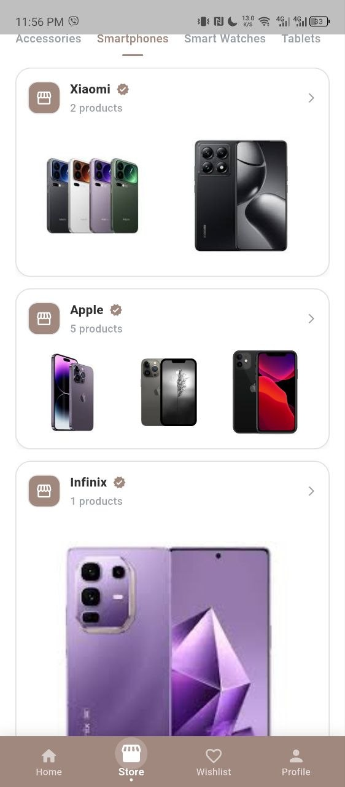
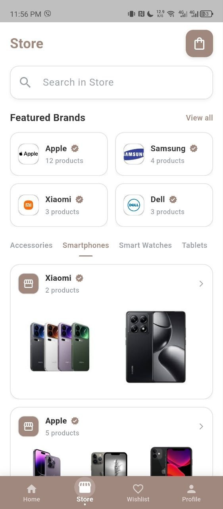
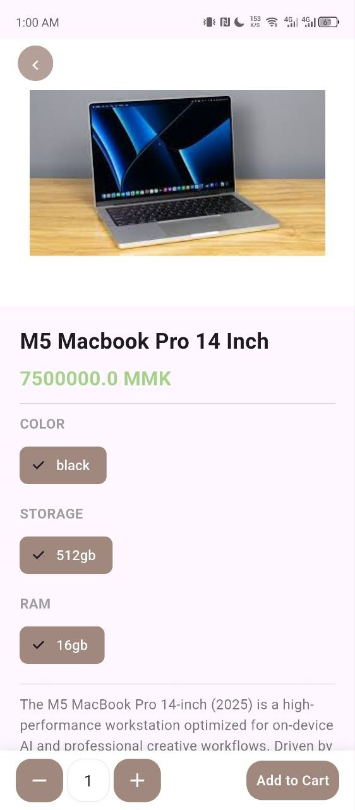
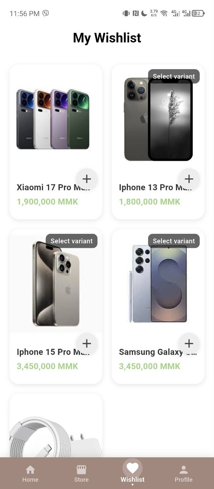
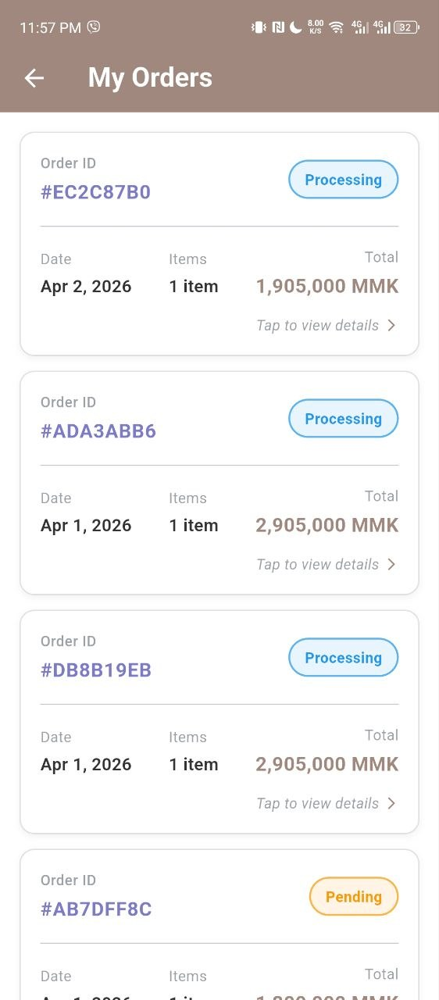
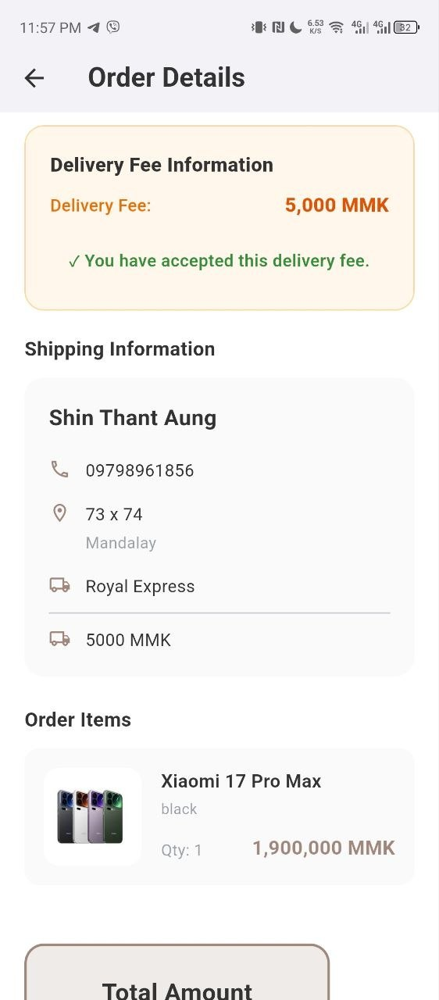

**Summary**
DigitalHub E-Commerce App is a Flutter-based, customer-facing application for a gadget and electronics store. It enables shoppers to browse categories and brands, review product details and variants (color, RAM, ROM), save items to a wishlist, add to cart, and place orders with delivery information. The app uses Supabase for authentication and data, stores cart state locally with SharedPreferences, and delivers notifications through Firebase Cloud Messaging. It is designed for Android, iOS, Web, and desktop targets using a single Flutter codebase.

Customer flow:
1. Open the app and land on the home experience.
2. Browse categories or brands, or search products in the store view.
3. Open a product to review details, variants, and images.
4. Add items to cart or save to the wishlist.
5. Review the cart and proceed to checkout.
6. Submit delivery information and place the order.
7. Track order history and open order details.

**Screens**
1. Home Screen - Entry screen for browsing featured content and starting product discovery.

1. Home Page - Main home feed with navigation into categories and product lists.

1. Store Screen - Catalog browsing experience for exploring available products.

1. Store Screen (Top Section) - Store header and top controls for browsing.

1. Product Details - Product information, images, and variant selection before adding to cart.

1. Wishlist - Saved items list for quick access to favorite products.

1. Orders - Order history list showing customer purchases.

1. Order Details - Detailed view of a single order, including status and summary.

**Features And How-To**
Features included:
- Product browsing by categories and brands.
- Product variants (color, RAM, ROM) and image galleries.
- Wishlist and cart management.
- Checkout with delivery information.
- Order history and order detail views.
- Supabase-backed authentication and data.
- Local cart persistence with SharedPreferences.
- Push notifications via Firebase Cloud Messaging.

Brief how-to guide:
1. Install dependencies with `flutter pub get`.
2. Run the app with `flutter run`.
3. Use the home screen to browse categories or open the store.
4. Open a product, choose variants, then add to cart or wishlist.
5. Go to the cart and proceed to checkout to place an order.
6. Review purchases in the Orders screen and open Order Details.
